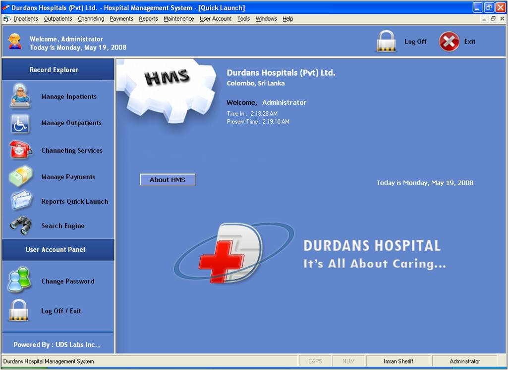



## Hospital Management System \- Extended Edition

### Description

This system automates all core functions and business processes that take place within a hospital. It could be used to handle all Inpatient, Outpatient, Channeling and Payment transactions with ease. I have worked to give it an amazing aesthetic look and feel too and it comes packed with awesome graphics :)

  I sincerely hope you will enjoy and benefit from using my application. Also, please take some time off to rate this code friend. This is my first submission on pscode, so I will be thrilled to get a favourable rating from you.

  Thank you for your time and Good Luck! :)
 
### More Info
 
Users are required to enter all necessary information as per each function. Data controls and advanced validation have been included, to ensure data integrity.

Please note that the background image on my Menu Driven Interface (MDI) is not my own. I obtained it from bob8works' "High School Enrollment System" (also available on this site), and then modified it to suit my application. All credit for the background image should go to him! :)

The system generates as many as 30 reports, covering Master Reports, Summarization Reports as well as Payment slips and invoices wherever necessary.

             |
---                |---
**Submitted On**   |2008-06-07 20:30:00
**By**             |[Ahamed Imran Sheriff](https://github.com/Planet-Source-Code/PSCIndex/blob/master/ByAuthor/ahamed-imran-sheriff.md)
**Level**          |Beginner
**User Rating**    |4.8 (231 globes from 48 users)
**Compatibility**  |VB 6\.0
**Category**       |[Complete Applications](https://github.com/Planet-Source-Code/PSCIndex/blob/master/ByCategory/complete-applications__1-27.md)
**World**          |[Visual Basic](https://github.com/Planet-Source-Code/PSCIndex/blob/master/ByWorld/visual-basic.md)
**Archive File**   |[Hospital\_M211559682008\.zip](https://github.com/Planet-Source-Code/ahamed-imran-sheriff-hospital-management-system-extended-edition__1-70655/archive/master.zip)

